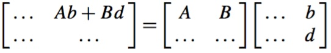

# Transforms
> 2016-12-15

## Introduction
- Transforms are used to scale, translate, reflect, shear and rotate 2D and 3D
  objects.
- `P(x,y)` is transformed into `P'(x',y')` using
```
x'=ax+by+e
y'=cx+dy+f
```
- `P(x,y,z)` is transformed into `P'(x',y',z')` using
```
x'=ax+by+cz+k
y'=dx+ey+fz+l
z'=gx+hy+jz+m
```
- It is convenient to express transforms as matrices.

## 2D Transforms

### Translation

- Change a shape's coordinates => change its geometry.
- If `P(x,y)` is a vertex on a shape, when we apply `x'=x+3` we create a new
  point `P'(x',y)` 3 units to the right.
- Similarly, when we apply `y'=y+1` we create a new point `P'(x,y')` displaced
  1 unit vertically.

### Scaling

- Shape scaling is effected by multiplying coordinates.
```
x'=2x
y'=1.5y
```
- This transform results in a horizontal scaling of 2 and a vertical scaling of
  1.5.
- **Note** that scaling is relative to the origin.

### Reflection

- Reversing the sign of the x-coordinate reflects a shape relative to the
  y-axis.
```
x'=-x
y'=y
```
- Reversing the sign of the y-coordinate reflects a shape relative to the
  x-axis.
```
x'=x
y'=-y
```

## Matrices

### Multiplication

`Aa+Bc` is the product of the top row of the first matrix by the left column of
the second matrix.

`Ab+Bd` is the product of the top row of the first matrix by the right column of
the second matrix.

`Ca+Dc` is the product of the bottom row of the first matrix by the left column
of the second matrix.

`Cb+Dd` is the product of the bottom row of the first matrix by the right column
of the second matrix.

### Determinant of a Matrix
Given a 2x2 matrix:

the determinant is a scalar quantity calculated by:

The determinant of a 2x2 matrix determines the change in area that occurs when
a polygon is transformed by the matrix.

### Homogeneous Coordinates

- For a point `(x,y)` there exists a homogeneous point `(xt,yt,t)` where t is an
  arbitrary number.
- It is possible to transform functions such as `f(x,y)` into the form
  `f(x/t,y/t)` without disturbing the degree of the curve.
- The figure shows a triangle on the `t=1` plane, and a similar triangle on
  a more distant plane.
- The t- or z-coordinate of the plane is immaterial because the x- and
  y-coordinates are eventually scaled by `t`.
- To keep things simple, it's a good idea for `t=1`, so that the point `(x,y)`
  has homogeneous coordinates `(x,y,1)` making scaling superfluous.
- Using 3D homogeneous coordinates instead of 2D Cartesian coordinates, we must
  attach 1 to every `(x,y)` pair.
- When a point `(x,y,1)` is transformed, it emerges as `(x',y',1)` and we
  discard the 1, which resolves the problem of creating a translation transform.

Given the homogeneous point `(x,y,1)`:

this expands to:
```
x'=ax+by+e
y'=cx+dy+f
1=1
```
and solves the problem of adding a constant.

### 2D Translation
Algebraic notation:

Matrix notation:

