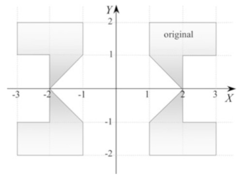

# Transforms
> 2016-12-15

## Introduction
- Transforms are used to scale, translate, reflect, shear and rotate 2D and 3D
  objects.
- `P(x,y)` is transformed into `P'(x',y')` using
```
x'=ax+by+e
y'=cx+dy+f
```
- `P(x,y,z)` is transformed into `P'(x',y',z')` using
```
x'=ax+by+cz+k
y'=dx+ey+fz+l
z'=gx+hy+jz+m
```
- It is convenient to express transforms as matrices.

## 2D Transforms

### Translation

- Change a shape's coordinates => change its geometry.
- If `P(x,y)` is a vertex on a shape, when we apply `x'=x+3` we create a new
  point `P'(x',y)` 3 units to the right.
- Similarly, when we apply `y'=y+1` we create a new point `P'(x,y')` displaced
  1 unit vertically.

### Scaling

- Shape scaling is effected by multiplying coordinates.
```
x'=2x
y'=1.5y
```
- This transform results in a horizontal scaling of 2 and a vertical scaling of
  1.5.
- **Note** that scaling is relative to the origin.

### Reflection

- Reversing the sign of the x-coordinate reflects a shape relative to the
  y-axis.
```
x'=-x
y'=y
```
- Reversing the sign of the y-coordinate reflects a shape relative to the
  x-axis.
```
x'=x
y'=-y
```

## Matrices

### Multiplication

1.
```
[Aa+Bc ...]=[A   B  ][a ...]
[...   ...] [... ...][c ...]
```
1.
```
[... Ab+Bd]=[A   B  ][... b]
[... ...  ] [... ...][... d]
```
1.
```
[...   ...] [... ...][a ...]
[Ca+Dc ...]=[C   D  ][c ...]
```
1.
```
[... ...  ] [... ...][... b]
[... Cb+Dd]=[A   B  ][... d]
```

